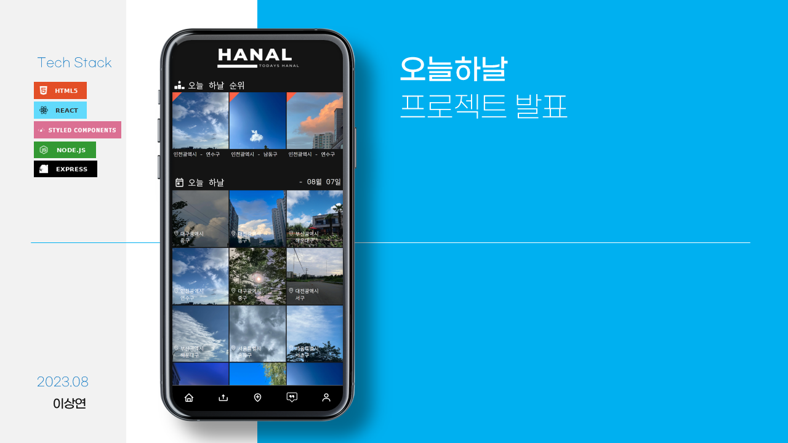
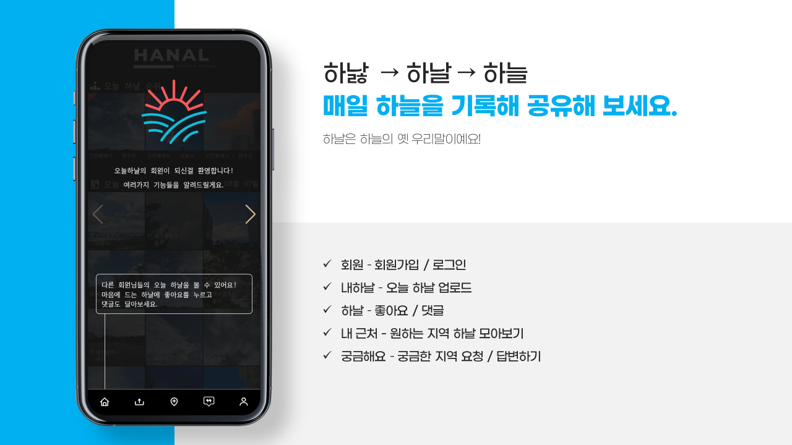
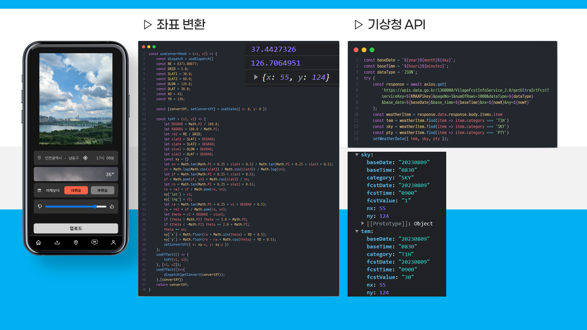
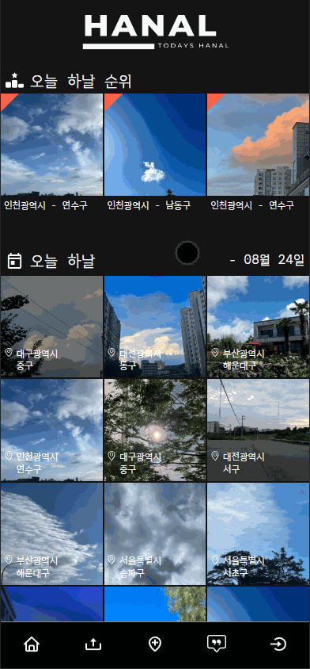
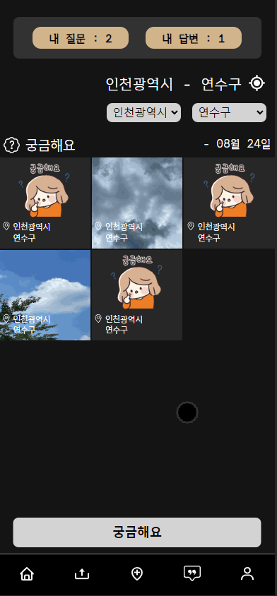
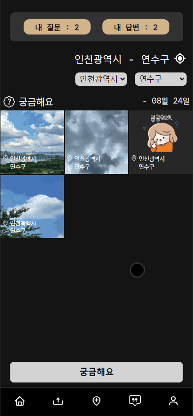

# PP-todays_hanal

## 하늘 사진 공유 SNS 페이지 제작 (모바일 버전)

'매일 하늘을 기록해 공유해 보세요'

## 프로젝트 사이트

<a href="https://yeonhub.github.io/todays-hanal-test/" target="_blank">  </a>
<a href="https://yeonhub.github.io/todays-hanal-test/" target="_blank"> </a>

## 기술 스택

          

## 프로젝트 제작 과정

### 1) 주제 선정

React기반으로 제작하되 추후 Node를 이용한 백엔드 작업을 고려하여 최대한 DB를 활용하고 싶었다.
그래서 단순하게 정적인 아이템들만 출력하는 것이 아닌 회원가입/로그인, 게시글 등록, 댓글 등록등 많은 데이터를 추가하고 삭제 할 수있는 프로젝트를 선정했다.

### 2) 소프트웨어 개발 프로세스

모든 기능과 볼륨을 정해놓지 않았으므로 Waterfall 모델 대신 오류를 쉽게 수정할 수 있고, 즉각적으로 피드백 적용이 가능한 Agile 모델을 적용했다.
하늘 사진을 업로드 한다는 중요한 기능을 먼저 구현한 후 다른 추가적인 기능을 개발하는 방법에선 점증적 모델과 비슷하다.

### 3) 프로젝트 참고 사이트

기본적인 UI/UX는 인스타그램 SNS를 참고했고, 유튜브의 Shorts 스윕 방식을 참고했다.

1) <a href="https://www.instagram.com/"  target="_blank"> 인스타그램</a>
2) <a href="https://www.youtube.com/"  target="_blank"> 유튜브</a>

## 프로젝트 발표

프로젝트 발표시 사용했던 PPT중 일부

 
 

## 프로젝트 기능 구현

1) 로그인 / 회원가입
2) 오늘 날짜 게시글 출력 / 좋아요 많은 게시글 출력
3) 하늘 사진 업로드 (현재 위치 기반 주소, 날씨 API)
4) 게시글 좋아요 / 댓글
5) 현재 위치 근처 게시글 보기 / 원하는 지역 게시글 보기
6) 하늘이 궁금한 지역 요청 / 답변하기

### 1) 로그인 / 회원가입

기존에 회원가입 한 회원은 아이디와 비밀번호를 입력하여 로그인 할 수 있고,
회원가입시 아이디/닉네임 중복검사, 비밀번호 확인 일치를 체크하여 가입할 수 있다.
회원가입 완료시 메인 페이지로 이동하게 되며 간단한 사용법이 팝업형식으로 소개된다.


```javascript
join(state, action) {
            const { loginId, loginPw, nickname } = action.payload;

    // 조건에 일치하면 true 불일치하면 false를 반환하는 some을 사용하여 중복검사를 했다.

            const isExistingId = state.acount.some((item) => item.loginId === loginId);
            const isExistingNickname = state.acount.some((item) => item.nickname === nickname);
            if (isExistingId) {
                alert('이미 존재하는 아이디입니다.');
                return;
            } else if (isExistingNickname) {
                alert('이미 존재하는 닉네임입니다.');
                return;
```

### 2) 오늘하날

오늘 날짜에 해당하는 게시글이 출력되며 시간을 기준으로 내림차순하여 보여줍니다.
(테스트를 위해 게시글의 날짜는 고정되어 있습니다.)
게시글 클릭시 해당하는 게시글을 팝업으로 보여주며 시간순으로 정렬된 게시글들이 위,아래로 스윕 가능합니다.
게시글엔 업로더 기준 위치와 날씨, 기온이 표시되며 좋아요 수와 가장 마지막 댓글을 확인할 수 있습니다.


```javascript
// 게시글 클릭시 해당하는 게시글을 찾아 첫 팝업으로 보여준다.

const scrollToBoardId = boardId;
if (swiperRef.current && scrollToBoardId !== null) {

// 클릭한 게시글의 boardId를 찾고

    const indexToScroll = todaysSortList.findIndex(item => iteboardId===scrollToBoardId);
    if (indexToScroll !== -1) {

// swiper를 slide해준다.

        swiperRef.current.swiper.slideTo(indexToScroll, 0);
        console.log(todaysSortList);
        console.log(`index : ${indexToScroll}`);
    }
}
```

```javascript
// 오늘 날짜 기준 좋아요를 가장 많이 받은 게시글 3개 상단에 출력

const todaysTopThreeList = todaysList.sort((a, b) => b.likesAcountId.length - alikesAcountId.length).slice(0, 3)
const todaysSortList = todaysList.sort((a, b) => b.dateTime - a.dateTime);
```

### 3) 내 하날

하늘 업로드시 게시글의 신뢰성을 위해 날짜, 시간, 위치, 날씨는 geolocation, KAKAO API, 기상청 API를 통해 자동으로 업로드 되며 수정할 수 없습니다.
따라서 위치 정보 조회 허용을 하지 않으면 업로드가 불가능합니다.
업로더는 사진을 찍거나 선택해서 게시할 수 있고 어제와 비교해 더운지 추운지 선택 가능하며 현재 날씨의 좋음 정도를 선택할 수 있습니다.


위경도로 행정구역을 받는 KAKAO API, 위경도를 기상청 API에서 사용 가능한 XY좌표로 변환, XY좌표로 날씨와 기온을 받는 기상청 API 총 3가지를 UserHooks으로 구현했습니다.

```javascript
src - hooks ┌ nowLocation.jsx
            ├ nowConvert.jsx
            └ nowWeather.jsx
```

최종적으로 날씨와 기온 정보를 얻는 순서

1) geolocation -> 현재 위치의 위도와 경도를 얻음
2) KAKAO API -> 위경도를 이용해 나온 행정구역중 시와 구만 파싱
3) nowConvert -> 위경도 값을 기상청 API에서 사용 가능한 XY좌표로 변환
4) 기상청 API -> XY좌표를 이용해 필요한 날씨와 온도만 파싱

```javascript

// nowLocation.jsx

const [location, setLocation] = useState({
    latitude: 0,
    longitude: 0,
    nowLocationCity: '',
    nowLocationGu: '',
    error: null,
});
useEffect(() => {
    if (navigator.geolocation) {
        navigator.geolocation.getCurrentPosition(success, error);
    } else {
        setLocation({
            ...location,
            error: '현재위치 기능을 지원하지 않는 브라우저입니다.',
        });
    }
}, []);
const success = (position) => {
    const { latitude, longitude } = position.coords;
    getKakaoAddress(latitude, longitude);
};
const error = (err) => {
    setLocation({
        ...location,
        nowLocationCity: '현재위치',
        nowLocationGu: '조회 실패',
        error: '현재위치를 가져올 수 없습니다.',
    });
};
--------------------------------------------------------------------------------------
 try {

// KAKAO REST API 사용

        const response = await axios.get(`https://dapi.kakao.com/v2/local/geocoord2regioncode.json?x=${longitude}&y=${latitude}`, {
            headers: {
                Authorization: `KakaoAK ${kakaoApiKey}`,
            },
        });
        const data = response.data;

// 여러 데이터중 시와 구만 파싱하여 사용
  
        const nowLocationCity = data.documents.length > 0 ? data.documents[0]region_1depth_name : 'unknown';
        const nowLocationGu = data.documents.length > 0 ? data.documents[0]region_2depth_name : 'unknown';
        setLocation(
            {
                ...location,
                latitude,
                longitude,
                nowLocationCity,
                nowLocationGu,
            }
        );
    } catch (error) {
        setLocation({
            ...location,
            nowLocationCity: '현재위치',
            nowLocationGu: '조회 실패',
            error: 'kakao API 호출 실패',
        });
    }

```

```javascript
const useConvertHook = (v1, v2) => {

// nowConvert.jsx
// 기상청 API에선 위경도로 위치 정보를 받는것이 아닌 XY좌표로 받기 때문에 변환이 필요하다. 

    const dispatch = useDispatch()
    const RE = 6371.00877;
    const GRID = 5.0;
    const SLAT1 = 30.0;
    const SLAT2 = 60.0;
    const OLON = 126.0;
    const OLAT = 38.0;
    const XO = 43;
    const YO = 136;

    const [convertXY, setConvertXY] = useState({ x: 0, y: 0 })

    const toXY = (v1, v2) => {
        let DEGRAD = Math.PI / 180.0;
        let RADDEG = 180.0 / Math.PI;
        let re2 = RE / GRID;
        let slat3 = SLAT1 * DEGRAD;
        let slat4 = SLAT2 * DEGRAD;
        let olon2 = OLON * DEGRAD;
        let olat2 = OLAT * DEGRAD;
        const xy = {}
        let sn = Math.tan(Math.PI * 0.25 + slat4 * 0.5) / Math.tan(Math.PI * 0.25 + slat3 * 0.5);
        sn = Math.log(Math.cos(slat3) / Math.cos(slat4)) / Math.log(sn);
        let sf = Math.tan(Math.PI * 0.25 + slat3 * 0.5);
        sf = Math.pow(sf, sn) * Math.cos(slat3) / sn;
        let ro = Math.tan(Math.PI * 0.25 + olat2 * 0.5);
        ro = re2 * sf / Math.pow(ro, sn);
        xy['lat'] = v1;
        xy['lng'] = v2;
        let ra = Math.tan(Math.PI * 0.25 + v1 * DEGRAD * 0.5);
        ra = re2 * sf / Math.pow(ra, sn);
        let theta = v2 * DEGRAD - olon2;
        if (theta > Math.PI) theta -= 2.0 * Math.PI;
        if (theta < -Math.PI) theta += 2.0 * Math.PI;
        theta *= sn;
        xy['x'] = Math.floor(ra * Math.sin(theta) + XO + 0.5);
        xy['y'] = Math.floor(ro - ra * Math.cos(theta) + YO + 0.5);
        setConvertXY({ x: xy.x, y: xy.y })
    };
    useEffect(() => {
        toXY(v1, v2);
    }, [v1, v2]);
    useEffect(()=>{
        dispatch(getConvert(convertXY));
    },[convertXY])
    return convertXY;
}

```

```javascript

// nowWeather.jsx

month = month < 10 ? '0' + month : month;
        day = day < 10 ? '0' + day : day;
        hours = hours - 1;
        if (hours < 0) {
            now.setDate(now.getDate() - 1);
            year = now.getFullYear();
            month = now.getMonth() + 1;
            day = now.getDate();
            hours = 24 + hours;
        }
        hours = hours < 10 ? '0' + hours : hours;
        minutes = '00';

        const baseDate = `${year}${month}${day}`;
        const baseTime = `${hours}${minutes}`;
        const dataType = 'JSON';
        try {
            const response = await axios.get(
                `https://apis.data.go.kr/1360000/VilageFcstInfoService_2.0/getUltraSrtFcst?serviceKey=${KMAAPikey}&pageNo=1&numOfRows=1000&dataType=${dataType}&base_date=${baseDate}&base_time=${baseTime}&nx=${nowX}&ny=${nowY}`
            );
            const weatherItem = response.data.response.body.items.item

// 여러 데이터중 기상 상태와 구름의 정도, 온도를 나타내 주는 것만 파싱

            const tem = weatherItem.find(item => item.category === 'T1H')
            const sky = weatherItem.find(item => item.category === 'SKY')
            const pty = weatherItem.find(item => item.category === 'PTY')
            setWeatherData({ tem, sky, pty });
        } catch (error) {
            console.error('--- ERROR ---', error);
        }
```

### 4) 좋아요 / 댓글

로그인이 되어있는 경우 게시글에 좋아요와 댓글을 추가할 수 있습니다.
게시글엔 가장 최근 댓글 하나만 표시됩니다.



```javascript
{
    boardId: 1,
    date: '2023-08-01',
    time: '09시 20분',
    dateTime: 20230801092000,
    authorAcountId: 1,
    loactionCity: '인천광역시',
    loactionGu: '연수구',
    weather: 'rain',
    temperatures: '28',
    yesterday: true,

// 좋아요를 누를시 해당 게시글의 likesAcountId 배열에 유저 고유의 ID가 추가된다.

    likesAcountId: [1, 2, 3],
    images: './images/sky/sky1.jpg',
    authorLike: 70,

// 댓글이 추가되면 commet에 push된다. 
// push될 객체엔 댓글의 ID, 댓글 작성자의 ID, 댓글 내용, 댓글 시간이 저장된다.

    comment: [
        { commentId: 1, commentAuthorId: 1, text: '하늘이 넘오넘오 예뻐용 쿠쿠', dateTime: 20230721083000 },
        { commentId: 2, commentAuthorId: 2, text: '예뻐용 쿠쿠', dateTime: 20230721093000 },
        { commentId: 3, commentAuthorId: 5, text: '뭐가 예쁨', dateTime: 20230721103000 },
        { commentId: 4, commentAuthorId: 4, text: '댓글입니다', dateTime: 20230721113000 },
    ]
},
```

### 5) 내 근처

현재 위치를 기준으로 시 단위의 게시글이 처음 출력되며, 구를 선택할 경우 해당 구만 출력이 됩니다.
게시글을 클릭했을 때 똑같이 팝업이 나오게 되고 위 아래로 스윕시 시단위만 일치하는 게시글을이 시간 내림차순으로 보여집니다. (구 단위까지 일치시 게시글이 적기 때문)


```javascript
    useEffect(() => {

// select option으로 시/구를 선택시 useEffect를 통해 출력될 게시글이 선택됩니다.

        let filteredList = board;
        if (nearCity != '시/도 선택') {
            filteredList = filteredList.filter(item => item.loactionCity === nearCity);
            setNearList(filteredList.sort((a, b) => b.dateTime - a.dateTime));
        }
        if (nearGu !== '구/군') {
            filteredList = filteredList.filter(item => item.loactionGu === nearGu);
            setNearList(filteredList.sort((a, b) => b.dateTime - a.dateTime));
        }
    }, [selectedSido, selectedGugun])
```

### 6) 궁금해요

궁금한 지역에 하늘 게시글이 없을때 혹은 지금 날씨가 궁금할 때 요청할 수 있다.
궁금한 지역의 시/구를 선택 후 궁금해요를 등록하면 해당 지역에 있는 사람만 답변이 가능하다.
답변으로 답변자, 날짜, 시간, 하늘 사진, 실제 날씨, 어제와 차이, 좋은 정도가 추가 된다.
궁금해요 작성자의 경우 본인이 작성한 궁금해요는 삭제가 가능하다.

 

```javascript
{

// 답변이 추가될 경우 answers 객체가 추가된다.

    answers: [
        {
            answerAuthorAcountId: 6,
            answerAuthorLike: 80,
            answerDate: "2023-08-01",
            answerTime: "15시 55분",
            answerWeather: "BsSun",
            answerYesterday: false,
            selectedImage: "./images/sky/sky8.jpg"
        }
    ],
    wonderBoardId: 6,
    date: '2023-08-01',
    time: '12시 55분',
    dateTime: 20230801125544,
    authorAcountId: 6,
    loactionCity: '인천광역시',
    loactionGu: '남동구',
    images: './images/sky/sky8.jpg'
},
```

```javascript

// 현재 로그인 되어있는 유저ID와 작성자 ID를 비교해 일치하면 삭제 버튼이 생긴다.

<p className='who'>

{wonderNickname}
    {ownerCheck && !currentAnswers
    ?
    <span className='delete' onClick={() => onDel()}><TiDeleteOutline /></span>
    : null
    }
</p>
<div className="wonderPopBg" style={{ display: bg ? 'block' : 'none' }}>
    <div className="alert" style={{ display: bg ? 'block' : 'none' }}>
        <span>
            궁금해요를 삭제합니다
        </span>
        <p>
            <button onClick={() => sureDel()}>삭제</button>
            <button onClick={() => setBg(false)}>취소</button>
        </p>
    </div>
</div>
```


## 리펙터링 (23.12.08)

[@리펙터링 후기](https://nonmajor-be-developer.tistory.com/entry/1%EC%B0%A8-%ED%94%84%EB%A6%AC%EC%98%A8%EB%B3%B4%EB%94%A9-%EC%B1%8C%EB%A6%B0%EC%A7%80FE-%EA%B3%BC%EC%A0%9C)

작업내용

1) 함수/컴포넌트를 데이터 / 계산 / 액션으로 구분
2) 재사용 가능 함수 캡슐화 및 분리

결과

1) 같은 기능을 하는 계산 함수를 담을 utils 폴더 생성
2) 계산 함수 분리 및 재사용
   
   📂utils
   
   ┣ 📜acountUtils.js
   
   ┣ 📜dateUtils.js
   
   ┣ 📜locationUtils.js
   
   ┗ 📜weatherUtils.js

```javascript
// weatherUtils.js

import { useSelector } from 'react-redux';

const getCurrentWeather = () => {
    const nowWeather = useSelector(state => state.acount.weather);
    const weather = nowWeather.nowWeather
    const temperatures = nowWeather.nowTem
    return {
        nowWeather,
        weather,
        temperatures
    };
};
export default getCurrentWeather
```
